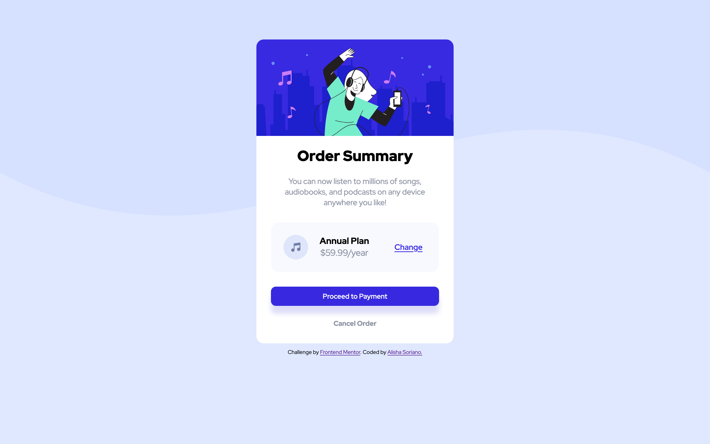
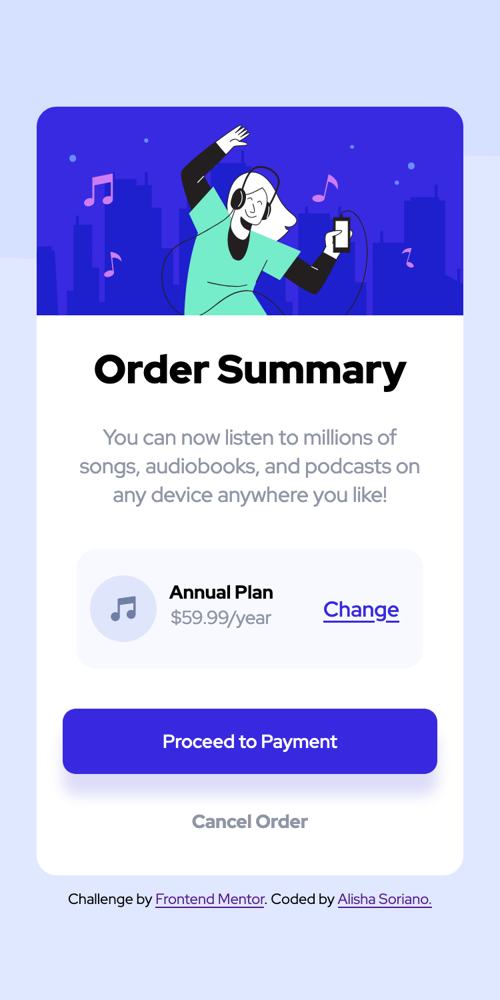

# Frontend Mentor - Order summary card solution

This is a solution to the [Order summary card challenge on Frontend Mentor](https://www.frontendmentor.io/challenges/order-summary-component-QlPmajDUj). Frontend Mentor challenges help you improve your coding skills by building realistic projects.

## Table of contents

- [Overview](#overview)
  - [The challenge](#the-challenge)
  - [Screenshot](#screenshot)
  - [Links](#links)
- [My process](#my-process)
  - [Built with](#built-with)
  - [What I learned](#what-i-learned)
  - [Continued development](#continued-development)
  - [Useful resources](#useful-resources)
- [Author](#author)

## Overview

The original idea for this project was taken from frontendmentor.io, where the task was to recreate the given screenshot with only HTML and CSS.

### The challenge

Users should be able to:

- See hover states for interactive elements

### Screenshot

### Links

- Solution URL: [GitHub](https://github.com/AlishaSo/order-summary-component)

## My process

I tackled this project by first writing in all of the HTML elements and corresponding text. Then I went ahead and added very basic CSS styling to add the background image and coloring, the text color and text size. Next step I worked on placement for the component itself, and the sections (first header and paragraph; the music image, text, and change button; last two buttons). I added the hover styling (cursor type, text color, background color) and sizing to the buttons at the same time. The annual plan section took me the most time to style, what with the spacing and sizing and aligning giving me a headache. Lastly, I went ahead and added the box shadow to the second-to-last button, and then added the needed code for the mobile vs desktop styles.

### Built with

- Semantic HTML5 markup
- CSS custom properties
- Flexbox
- CSS Grid

### What I learned

- Applying styles to elements will behave differently is you apply them via a class versus an id.

- How to group and manipulate text

- How to use the correct media feature and value

### Continued development

Going forward, I want to get more practice on the flex box and mobile-first concepts.
While this implementation does look a lot like the original, I think that the way I obtained my results is not optimized at all. As well as needing to work on my color theory/manipulation of colors. Also need to look into difference between styling via class vs id's.

### Useful resources

- [Colorpick Eyedropper](https://addons.mozilla.org/en-US/firefox/addon/colorpick-eyedropper/?utm_source=addons.mozilla.org&utm_medium=referral&utm_content=search) - This Firefox extension helped me immensenly in getting the appropriate colors for the layout.
This is why mostly all of my coloring is done in hex form, though the tool does offer
hsl and rbg formats as well.

- [HTML and CSS Tutorial - Create a Website for Beginners](https://www.youtube.com/watch?v=kMT54MPz9oE&t=3072s) - I did this tutorial a few years ago, and honestly, going back in and reviewing some of my code from this helped me to remember how to do certain things such as aligning buttons, aligning the text within the buttons, spacing, etc.

- [How to import Google Fonts in HTML](https://www.geeksforgeeks.org/how-to-import-google-fonts-in-html/) - For help on importing the proper font. Also to note, is (https://fonts.google.com/specimen/Red+Hat+Display) itself, as I had to go on there and look at their 'Use on the web' section to see how to deal with the different boldness types.

- [MDN's box-shadow Documentation](https://developer.mozilla.org/en-US/docs/Web/CSS/box-shadow) - This helped me to better understand which method to use for the shadow on the button, and I learned how to align the shadow, and make it as tall or short as needed.

- [iColorpalette](https://icolorpalette.com/) - This site helped me narrow down the color for the box shadow on the 'proceed to payment button'. I then used the hsl format, and
tweaked it a bit more to fit the color that I could see from the screenshot.

## Author

- GitHub - [Alisha S.](https://github.com/AlishaSo/)
- Frontend Mentor - [@AlishaSo](https://www.frontendmentor.io/profile/AlishaSo)
